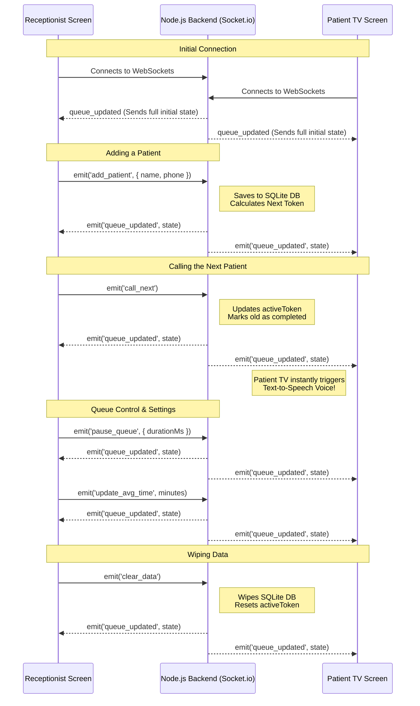

# Socket.io Event Diagram

A **Socket Event Diagram** is a visual map that shows exactly how your frontend (Vercel) and backend (Render) talk to each other in real-time. Because your app uses WebSockets (Socket.io) instead of traditional HTTP requests, the connection stays open, allowing the server to instantly "push" updates to all screens the moment anything changes.

Here is the exact real-time flow of your **Queue Cure '26** application:

### Why this is awesome:
In a traditional app, the Patient TV would have to constantly refresh the page every 5 seconds to check if a new patient was called. With this Socket architecture, the Patient TV sits completely idle until the Server pushes a `queue_updated` event to it, making it lightning-fast and incredibly efficient!
